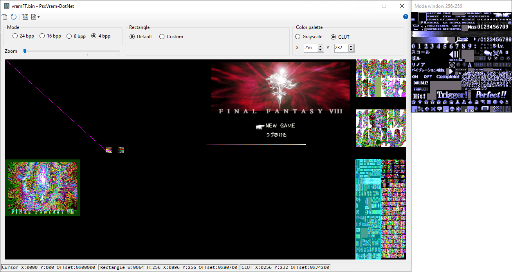

PsxVram-DotNet
===========

Viewer for displaying PSX VRAM dumps.


Features
-----
- Main PSX emulators savestates support
- Predefined texture pages and CLUTs positions for each mode for ease of VRAM navigation
- GUI with mouse/keyboard naviation
- Save image function for textures ripping
- DotNet Core application allows to port it to Linux as well


Start
-----

```
PsxVram-DotNet [InputFile]
```

Supported ***InputFile*** formats:
- **ePSXe** (1.0.6 and 2.0.5) savestates
- **PCSX** (1.5) and all based on this version forks, like Agemo or Zhaosili Debugger savestates
- **PCSXR** (1.9.93) savestates  

*For most GPU plugins VRAM start addresses for these savestates are the same 
and should open correctly. But keep in mind, that start address (and even dump contents) can depend on GPU plugin.
- **RetroArch** (Core: Beetle PSX or Beetle PSX HW): `.auto` or `.state` savestate file, which should be uncompressed. Emulator's `Savestate Compression` option under `Settings > Saving` should be turned off.

- **no$psx** (2.0): `.sna` savestate file, which should be uncompressed. Emulator's save file settings: none, raw or uncompressed.
- **Raw** binary 1MB PSX VRAM dump. This be obtained from most PSX debugging emulators, like PCSX or No$PSX. 

*Emulator's version numbers are tested ones, it's possible, that other versions savestates will be also opened correctly.


Application handles input file the following way:

- If `InputFile` command line argument is set, it will be loaded immediately. Which also allows you just to drag&drop files on the app icon in windows explorer.
- If a `vram.bin` file is found in current directory, and no command line arguments are provided, vram.bin will be loaded.
- If no proper format files are found, application opens in disabled mode and you can load new file via `Open file` button.

Usage
-------
Base case scenario, it is assumed that you find the place you are interested in the game. You make savestate and open it with application.  
Or you save emulator VRAM dump into a specific folder. You can then copy the application to this folder and it will open vram.bin every time it starts.  
Then, you can view the entire dump in all supported PSX modes. Left mouse button moves rectangle, right mouse button moves CLUT line. Mouse button places rectangle with default padding (which must fit in most cases). If needed, rectangle and CLUT position can be adjusted with hotkeys or corresponding form controls.  
You can then move through the code in the emulator, rewrite the updated dump over the old one, update the application with the button and see the last changes in the PSX video memory.  
In the status bar, you can see the necessary coordinates and addresses of the pieces of graphics you are interested in for further work in the debugger.  
It is possible to save mode window contents to BMP file in corresponding VRAM dump folder. Bitmap mode and palette are transferred to BMP according to current mode. Transparency is supported.  

Hotkeys
-------
- W/S/A/D: Move view rectangle
- Ctrl + (W/S/A/D): Move CLUT line
- Shift +(W/S/A/D) direction: Change rectangle size
- Mouse. Left: move view rectangle, Right: move CLUT line, Middle: drag image if zoomed

History
--------
Initially 'Psx V-Ram' was created by Agemo as pure Windows API application, then rewritten by Griever into 'PsxVram-SDL' for multiplatform purposes, which was then rewritten into this application for further development with normal GUI features possible.

Licence
-------

For license information please see LICENSE.md

Credits
-------
- Current version developer https://github.com/romhack/
- Original idea by Agemo http://www.romhacking.net/community/737/
- https://github.com/aybe/
